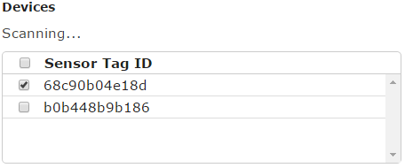

# node-red-contrib-sensortag
This [Node-RED](http://nodered.org/) node can be used connect to any number of Ti SensorTags and read the sensor data into Node-RED.

### Install

This node is available as a package on npm. To install run:
```
npm install https://github.com/yagitsawa/node-red-contrib-sensortag.git
```

This node uses `noble` as the underlying library. To read about its prerequisites you can visit [its GitHub repository](https://github.com/sandeepmistry/noble#prerequisites).

### Configuration

This node can be configured to connect to any number of sensor tags. The device scanning process will start on its own along with Node-RED. The discovered devices (identified by their MAC address) will show up in the node's configuration window, where you can select any number of sensor tags to connect to.



If you deploy a sensor tag node with no devices selected, the node will be disabled and show up as show below.


Once you select one or more devices and deploy the flow, the node will immediately attempt to connect to the selected devices, and the node's status will change accordingly.


Due to the nature of the discovery process, nodes will only attempt to connect to their devices once all devices required by all nodes have been discovered.
If a device required by one of the nodes is not found, none of the nodes will connect, and the configuration panel for the node at fault will show you which device is missing.


Each node can specify a set of sensor read intervals for the devices the node will connect to. For the supported sensors, the intervals will be forced between 10 - 2550ms.

### Output

The node will output messages as it reads sensor data. The format of the message is:
* `msg`
  * `sensor`: Name of the sensor (e.g. `accelerometer`,`pressure`)
  * `payload`:
    * `id`: A unique ID built out of the host's MAC address, the sensor tag's MAC address and an integer number (0-7) representing the sensor (e.g. `29ab3d013384.b3b1cdf7fec0.2`)
    * `tstamp`: UNIX timestamp in milliseconds when the data was received
    * `json_data`: JSON Object containing sensor data. Differs for most sensors.
